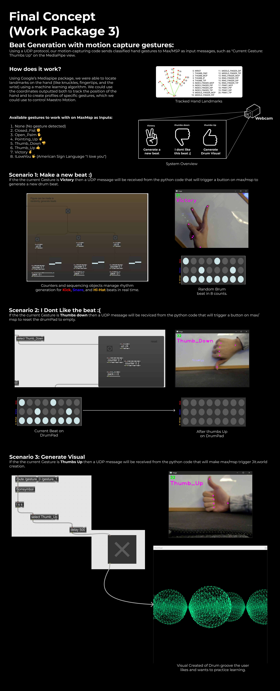

# MaestroMotion-AXD-Vihan-Gemawat (CID:02075504)

## Table of Contents
- [Initial Ideation](#Introduction)
- [Overview](#overview)
- [Work Package 1: Creating a DrumPad On MaxMSP](#work-package-1-creating-a-drumpad-on-maxmsp)
- [Work Package 2: Drum Beat Visualizer using Jitter](#work-package-2-drum-beat-visualizer-using-jitter)
- [Work Package 3: Beat Generation with Motion Capture Gestures](#work-package-3-beat-generation-with-motion-capture-gestures)
- [Conclusion & Future Reflection](#conclusion--future-reflection)
- [Team Management](#team-management)


---

## Initial Ideation


---


---

## Overview


---


## Work Package 1: Creating a DrumPad On MaxMSP
This phase explores drum grooves can be played on a DrumPad in MaxMsp.


#### **Trying playing this Drum groove on WP1.maxpat patch with the instructions below:**


### **Setup:**
1. Go to WP1 folder.
2. Load the **DrumPad Max Patch** (`WP1.maxpat`) in Maxmsp.
3. Run the patch and input the drum groove as shown in the image. (Bille-jean by Micheal Jackson).

### **Watch the video demonstration::**

[](https://youtu.be/I6NFUdLJbnA)

---

## Work Package 2: Drum Beat Visualizer using Jitter
In this phase, we introduce **audio-driven visualizations** that react to drum beats.


### **Setup:**
1. Open **Max/MSP**.
2. Load the **Beat Visualizer Patch** (`WP2.maxpat`).
3. Ensure **Jitter** is enabled for graphical visualization.
4. Play a drum loop to see visual effects reacting to beat amplitude.

### **Watch the video demonstration::**

[](https://youtu.be/Aua2g5rv_I8)


---

## Work Package 3: Beat Generation with Motion Capture Gestures
This phase explores gesture-controlled beat generation using **MediaPipe & OpenCV**.



### **Setup:**

```
pip install mediapipe
```
```
pip install opencv-python
```
```
pip install python-osc
```

### **Watch the video demonstration::**

[](https://youtu.be/7CM9-ZBzIME)

---

## Conclusion & Future Reflection


---

## Team management


---
