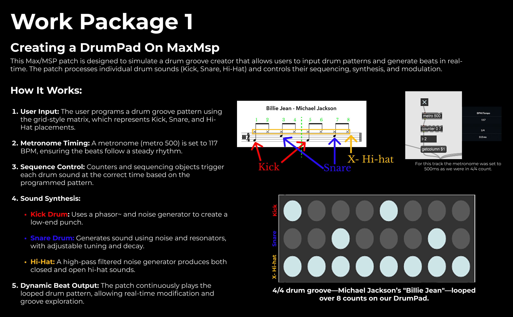
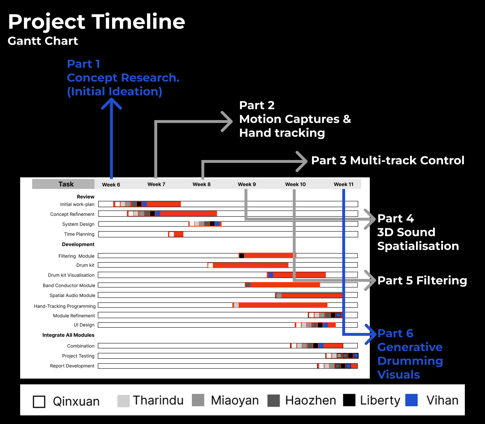

# MaestroMotion-AXD-

MaestroMotion-AXD is an interactive system that integrates **gesture recognition, drum sequencing, and real-time visualization** to create an immersive musical experience. Using **MediaPipe** for hand tracking, **Max/MSP** for audio processing, and **Jitter** for visual effects, this system allows users to generate beats and visuals dynamically using simple hand gestures.

## Table of Contents
- [Overview](#overview)
- [Work Package 1: Creating a DrumPad On MaxMSP](#work-package-1-creating-a-drumpad-on-maxmsp)
- [Work Package 2: Drum Beat Visualizer using Jitter](#work-package-2-drum-beat-visualizer-using-jitter)
- [Work Package 3: Beat Generation with Motion Capture Gestures](#work-package-3-beat-generation-with-motion-capture-gestures)
- [Conclusion & Future Reflection](#Conclusion & Future Reflection)
- [Team management](#Team management)

---

## Overview

---

## Work Package 1: Creating a DrumPad On MaxMSP
This phase explores how visual feedback can help users learn and understand drum groove patterns in instrumental music.

### **Setup:**
1. Open **Max/MSP**.
2. Load the **DrumPad Max Patch** (`WP1.maxpat`).
3. Run the patch and input a drum pattern.
4. Observe real-time visual representation of the groove pattern.

### **How It Works:**
- The DrumPad allows users to simulate drum groove creation.
- Audio-reactive visuals are generated in **Jitter**.
- The system loops an 8-count groove using **Michael Jackson's "Billie Jean"** as a reference.

### **Watch the video demonstration::**

---

## Work Package 2: Drum Beat Visualizer using Jitter
In this phase, we introduce **audio-driven visualizations** that react to drum beats.

### **Watch the video demonstration::**

### **Code Setup:**
1. Open **Max/MSP**.
2. Load the **Beat Visualizer Patch** (`WP2.maxpat`).
3. Ensure **Jitter** is enabled for graphical visualization.
4. Play a drum loop to see visual effects reacting to beat amplitude.

### **How It Works:**
- Captures drum beat amplitude using **peakamp~** object.
- Normalized amplitude values are mapped to motion.
- The **jit.world object** renders graphics in sync with the rhythm.

---

## Work Package 3: Beat Generation with Motion Capture Gestures
This phase explores gesture-controlled beat generation using **MediaPipe & OpenCV**.

### **Watch the video demonstration::**

---

## Conclusion & Future Reflection

---

## Team management

---